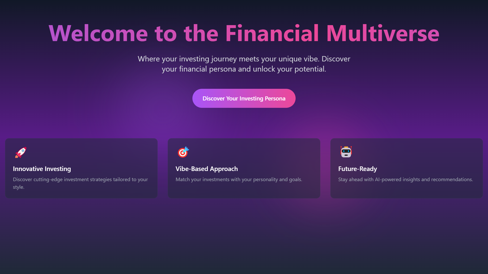
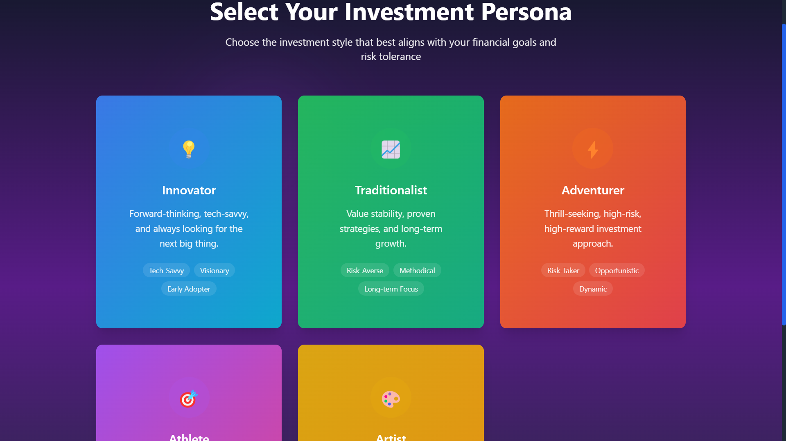
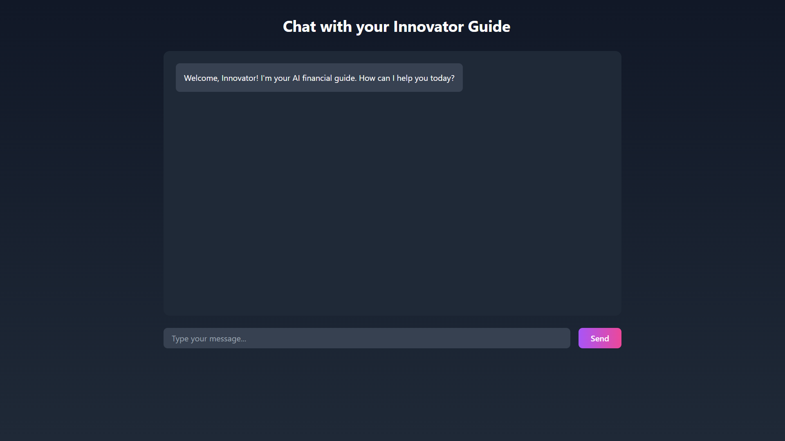

# Financial Multiverse - FinTech Web App

A modern, Gen Z-focused fintech website prototype that helps users discover their investing persona through an interactive and engaging interface.

## Screenshots

### Landing Page

*Modern, gradient-based landing page with animated elements and clear call-to-action*

### Persona Selection

*Interactive persona selection with beautiful card designs and smooth animations*

### Chat Interface

*AI-powered chat interface with persona-specific guidance*

## Features

- 🎨 Modern, responsive design with Tailwind CSS
- 🚀 Interactive persona selection with animations
- 💫 Smooth transitions and micro-interactions
- 📱 Mobile-first approach
- 🤖 AI-powered chat interface
- 🎯 Personalized investment guidance

## Tech Stack

- **Frontend**: Next.js, React, Tailwind CSS, Framer Motion
- **Backend**: Next.js API Routes
- **Database**: Simple JSON storage (mocked Supabase)

## Project Structure

```
fintech_intern_assignment/
├── frontend/                # Next.js frontend application
│   ├── pages/              # Application pages
│   │   ├── index.js        # Landing page
│   │   ├── persona.js      # Persona selection
│   │   └── chat.js         # Chat interface
│   ├── public/             # Static assets
│   ├── styles/             # Global styles
│   ├── utils/              # Utility functions
│   └── data/               # Mock data
├── README.md               # Project documentation
└── Assignment_Instructions.txt
```

## Getting Started

### Prerequisites

- Node.js (v14 or higher)
- npm or yarn

### Installation

1. Clone the repository:
   ```bash
   git clone [repository-url]
   cd fintech_intern_assignment
   ```

2. Install dependencies:
   ```bash
   cd frontend
   npm install
   ```

3. Start the development server:
   ```bash
   npm run dev
   ```

The app will be available at `http://localhost:3000`

## Key Features

### Landing Page
- Modern, gradient-based design
- Animated hero section
- Feature highlights
- Clear call-to-action

### Persona Selection
- Interactive card-based selection
- Smooth animations and transitions
- Responsive grid layout
- Visual feedback on selection

### Chat Interface
- AI-powered responses
- Persona-specific guidance
- Real-time typing indicators
- Modern chat UI

## Implementation Details

- **Responsive Design**: Fully responsive layout using Tailwind CSS
- **Animations**: Smooth transitions and micro-interactions using Framer Motion
- **Performance**: Optimized for fast loading and smooth interactions
- **Accessibility**: Built with accessibility best practices in mind

## AI Tools Experience

During the development of this project, I utilized AI-powered development tools to enhance my productivity and learning:

### Cursor AI Assistant
- **Code Generation**: Used for generating boilerplate code and component structures
- **Code Refactoring**: Helped optimize and clean up existing code
- **Debugging**: Assisted in identifying and fixing issues
- **Learning**: Provided explanations of complex concepts and best practices

### Key Learnings
1. **Modern Web Development Practices**:
   - Learned about component-based architecture
   - Understood the importance of responsive design
   - Gained insights into performance optimization

2. **UI/UX Design Principles**:
   - Discovered modern design patterns
   - Learned about micro-interactions and animations
   - Understood the importance of accessibility

3. **Technical Skills**:
   - Improved understanding of Next.js and React
   - Learned about Tailwind CSS utility-first approach
   - Gained experience with Framer Motion animations

4. **Problem-Solving**:
   - Learned to break down complex problems
   - Understood the importance of clean code
   - Gained experience in debugging and optimization

## Submission Notes

This project was developed as part of a fintech internship assignment. It demonstrates:
- Modern web development skills
- UI/UX design principles
- Frontend development best practices
- Creative problem-solving
- Effective use of AI tools in development

## License

This project is licensed under the MIT License. 